# Claude Code Hooks 项目技术方案文档

> 版本：v2.0 | 最后更新：2026-06-01

---

## 目录

- [一、项目概述](#一项目概述)
- [二、系统架构](#二系统架构)
- [三、Hook 通信协议详解](#三hook-通信协议详解)
- [四、核心模块详解](#四核心模块详解)
- [五、插件体系详解](#五插件体系详解)
- [六、关键技术设计](#六关键技术设计)
- [七、项目目录结构](#七项目目录结构)
- [八、数据字典与字段映射](#八数据字典与字段映射)
- [九、配置与部署指南](#九配置与部署指南)
- [十、扩展开发指南](#十扩展开发指南)
- [附录 A：正则表达式速查](#附录-a正则表达式速查)
- [附录 B：错误码与异常处理](#附录-b错误码与异常处理)

---

## 一、项目概述

### 1.1 项目定位

本项目是 **Claude Code** 的官方示例与插件仓库。Claude Code 是 Anthropic 推出的 AI 编程助手终端工具，**Hook（钩子）机制** 是其核心扩展能力之一，允许用户在 AI 助手执行操作的特定生命周期节点插入自定义逻辑，实现：

- 安全审查 — 拦截危险命令、检测代码漏洞
- 行为引导 — 引导 AI 使用更优工具和最佳实践
- 规范执行 — 在代码编辑后自动检查编码规范
- 流程控制 — 阻止 AI 过早停止，确保审查流程完整

### 1.2 核心价值主张

| 价值维度 | 具体能力 | 典型场景 |
|----------|----------|----------|
| **安全防护** | 在 AI 执行命令前拦截危险操作 | 阻止 `rm -rf /`、检测硬编码密码 |
| **行为引导** | 引导 AI 使用更优工具替代低效命令 | 用 `rg` 替代 `grep`，用 `rg --files` 替代 `find -name` |
| **规范执行** | 在代码编辑后自动检查安全漏洞和编码规范 | 检测 `console.log` 调试语句、SQL 注入模式 |
| **流程控制** | 阻止 AI 过早停止 | 要求在停止前运行测试用例 |
| **深度审查** | 结合 LLM 对代码变更进行语义级安全分析 | 跨文件数据流追踪、IDOR/SSRF 漏洞检测 |

### 1.3 技术栈概览

| 技术层 | 选型 | 原因 |
|--------|------|------|
| 语言 | Python 3.7+ | Claude Code 原生支持，标准库功能足够 |
| 数据格式 | JSON | Hook 输入输出的标准格式，`json` 模块原生支持 |
| 配置格式 | YAML frontmatter + Markdown | 人类可读、易于编辑、零依赖解析 |
| 正则引擎 | `re` 标准库 | Python 内置，性能足够，支持完整正则语法 |
| LLM 调用 | `urllib.request` → Anthropic API | security-guidance 插件需要，无需第三方 HTTP 库 |
| 缓存策略 | `functools.lru_cache` | Python 内置 LRU 缓存，零配置 |

---

## 二、系统架构

### 2.1 整体架构图

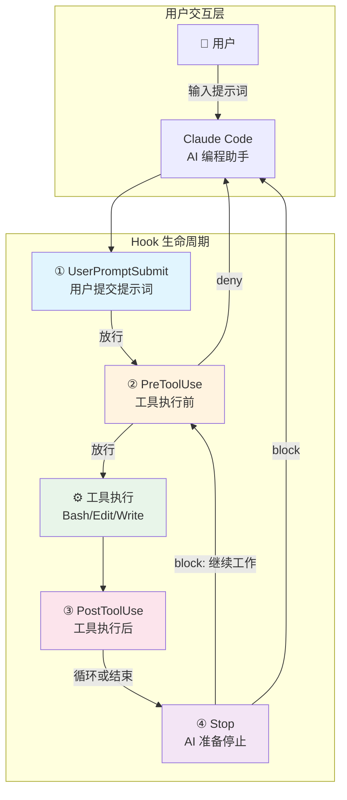

**生命周期说明**：

1. **UserPromptSubmit** — 用户提交提示词时首先触发，可用于捕获基线状态、注入上下文
2. **PreToolUse** — AI 每次调用工具**之前**触发，可拦截/阻止工具调用
3. **工具执行** — 实际执行 Bash/Edit/Write 等工具操作
4. **PostToolUse** — 工具执行**之后**触发，可对结果进行后处理
5. **Stop** — AI 认为任务完成、准备停止时触发，可阻止其过早停止

### 2.2 Hook 系统数据流时序图

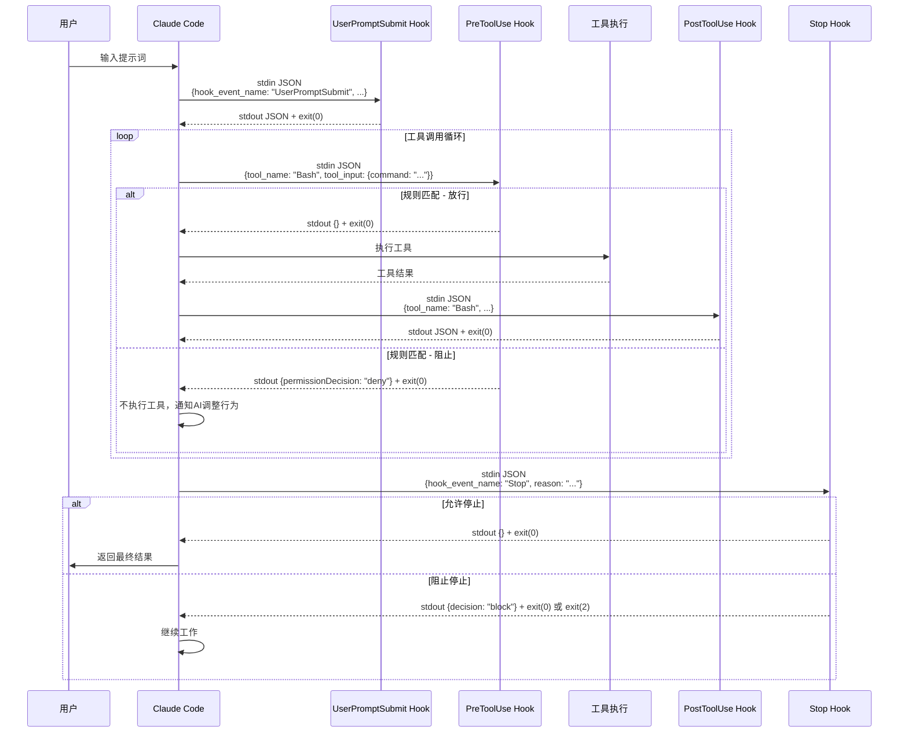

### 2.3 三层组件架构图

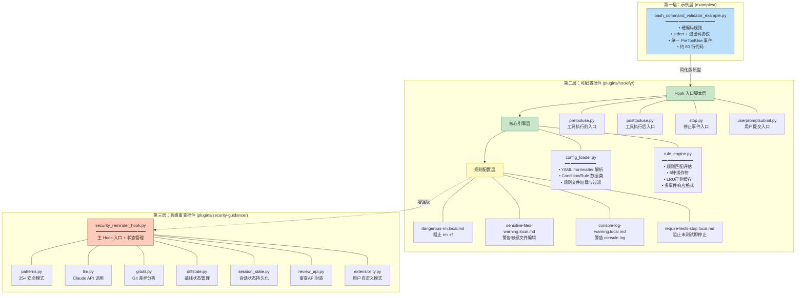

**三层架构演进关系**：

| 层级 | 复杂度 | 依赖 | 适用场景 |
|------|--------|------|----------|
| 示例层 | ★☆☆ | 零 | 快速原型、学习 Hook 机制、简单校验 |
| hookify 插件 | ★★☆ | 零 | 可配置规则、团队规范、多场景覆盖 |
| security-guidance | ★★★ | Claude API | 企业级安全审查、LLM 深度分析 |

---

## 三、Hook 通信协议详解

### 3.1 通信模型

Hook 脚本与 Claude Code 之间采用**进程间通信（IPC）**模型：

```
Claude Code (父进程)
    │
    ├─── 启动 Hook 子进程
    │
    ├─── 通过 stdin (管道) 传入 JSON 数据 ───→ Hook 脚本
    │
    ├─── 通过 stdout (管道) ←──── 接收 JSON 响应 ──── Hook 脚本
    │
    ├─── 通过 stderr (管道) ←──── 接收提示消息 ──── Hook 脚本
    │
    └─── 读取退出码 ←──── Hook 脚本退出
```

**关键约束**：
- Hook 脚本必须在 **timeout**（默认 10 秒）内完成并退出
- 超时未退出的 Hook 进程会被 Claude Code 强制终止
- stdin 中的 JSON 数据只能读取一次（流式消费）

### 3.2 输入格式（Claude Code → Hook）

#### 3.2.1 PreToolUse / PostToolUse 事件

当 AI 调用工具时触发。`tool_name` 标识工具类型，`tool_input` 包含工具参数。

```json
{
  "tool_name": "Bash",
  "tool_input": {
    "command": "grep -r 'password' /etc"
  },
  "hook_event_name": "PreToolUse",
  "session_id": "abc123",
  "cwd": "/home/user/project"
}
```

**tool_name 取值与 tool_input 结构对照表**：

| tool_name | 说明 | tool_input 字段 |
|-----------|------|------------------|
| `Bash` | 执行 Shell 命令 | `command` (str): 完整命令字符串 |
| `Edit` | 编辑文件（搜索替换） | `file_path` (str), `old_string` (str), `new_string` (str) |
| `Write` | 写入整个文件 | `file_path` (str), `content` (str) |
| `MultiEdit` | 批量编辑文件 | `file_path` (str), `edits` (list): [{`old_string`, `new_string`}] |
| `Read` | 读取文件 | `file_path` (str), `offset` (int), `limit` (int) |
| `Grep` | 搜索代码 | `pattern` (str), `path` (str), `type` (str) |
| `Glob` | 文件名匹配 | `pattern` (str), `path` (str) |

#### 3.2.2 Stop 事件

当 AI 认为任务完成、准备停止响应时触发。

```json
{
  "hook_event_name": "Stop",
  "reason": "Task completed",
  "transcript_path": "/tmp/session/transcript.txt",
  "session_id": "abc123",
  "cwd": "/home/user/project"
}
```

| 字段 | 类型 | 说明 |
|------|------|------|
| `hook_event_name` | str | 固定值 `"Stop"` |
| `reason` | str | AI 给出的停止原因 |
| `transcript_path` | str | 会话记录文件路径（可读取完整对话历史） |
| `session_id` | str | 会话唯一标识 |
| `cwd` | str | 当前工作目录 |

#### 3.2.3 UserPromptSubmit 事件

当用户输入提示词并提交时触发。这是生命周期中最早触发的 Hook。

```json
{
  "hook_event_name": "UserPromptSubmit",
  "user_prompt": "帮我重构这段代码",
  "session_id": "abc123",
  "cwd": "/home/user/project"
}
```

| 字段 | 类型 | 说明 |
|------|------|------|
| `hook_event_name` | str | 固定值 `"UserPromptSubmit"` |
| `user_prompt` | str | 用户输入的完整提示词文本 |
| `session_id` | str | 会话唯一标识 |
| `cwd` | str | 当前工作目录 |

### 3.3 输出格式（Hook 脚本 → Claude Code）

Hook 脚本有两种输出协议：**简单协议**（stderr + 退出码）和 **JSON 协议**（stdout）。

#### 3.3.1 简单协议（stderr + 退出码）

适用于独立的 Hook 脚本（如 `bash_command_validator_example.py`）：

| 退出码 | 输出通道 | 行为 | 适用场景 |
|--------|----------|------|----------|
| `0` | 无 | 允许操作继续执行 | 规则未匹配 / 校验通过 |
| `1` | stderr | 向用户显示消息，**不通知 AI** | 非阻断性警告、格式错误 |
| `2` | stderr | **阻止操作**，并将消息通知 AI | 阻断性校验失败 |

**退出码选择决策树**：

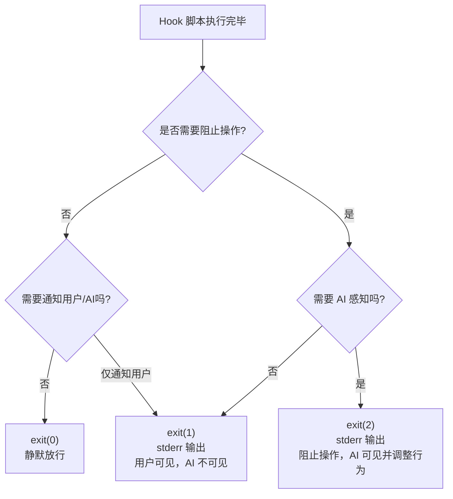

**示例**：

```python
# exit(0) — 校验通过，放行
sys.exit(0)

# exit(1) — JSON 解析失败，通知用户但不影响 AI
print(f"Error: Invalid JSON input: {e}", file=sys.stderr)
sys.exit(1)

# exit(2) — 校验不通过，阻止操作并让 AI 知道原因
print("• Use 'rg' instead of 'grep'", file=sys.stderr)
sys.exit(2)
```

#### 3.3.2 JSON 协议（stdout）

适用于插件式 Hook（如 hookify、security-guidance），通过 stdout 输出 JSON 响应：

**1）空响应 — 允许操作**

```json
{}
```

**2）警告响应 — 显示消息但不阻止**

```json
{
  "systemMessage": "**[warn-console-log]**\n🔍 Console.log detected in TypeScript file."
}
```

**3）阻止响应 — PreToolUse/PostToolUse 事件**

```json
{
  "hookSpecificOutput": {
    "hookEventName": "PreToolUse",
    "permissionDecision": "deny"
  },
  "systemMessage": "**[block-dangerous-rm]**\n⚠️ Dangerous rm command detected!"
}
```

**4）阻止响应 — Stop 事件**

```json
{
  "decision": "block",
  "reason": "**[require-tests-run]**\nTests not detected in transcript!",
  "systemMessage": "**[require-tests-run]**\nTests not detected in transcript!"
}
```

**响应字段说明**：

| 字段 | 类型 | 说明 |
|------|------|------|
| `systemMessage` | str | 传递给 AI 助手的消息，AI 可据此调整行为 |
| `hookSpecificOutput` | object | 事件特定的结构化输出 |
| `hookSpecificOutput.hookEventName` | str | Hook 事件名称 |
| `hookSpecificOutput.permissionDecision` | str | `"deny"` = 拒绝执行工具 |
| `decision` | str | Stop 事件专用，`"block"` = 阻止 AI 停止 |
| `reason` | str | Stop 事件阻止的原因 |
| `additionalContext` | str | 注入到 AI 上下文的额外信息（security-guidance 使用） |

---

## 四、核心模块详解

### 4.1 bash_command_validator_example.py（简单示例）

#### 4.1.1 模块信息

| 维度 | 说明 |
|------|------|
| **文件路径** | `examples/hooks/bash_command_validator_example.py` |
| **代码行数** | ~80 行（含注释） |
| **Hook 类型** | PreToolUse（仅匹配 Bash 工具） |
| **功能概述** | 校验 Bash 命令，拦截 `grep` 和 `find -name`，建议使用 `rg` |
| **实现方式** | 硬编码规则列表 + 正则匹配 |
| **通信协议** | 简单协议（stderr + 退出码） |

#### 4.1.2 核心数据流

```
Claude Code
  │
  ├── stdin ──→ json.load(sys.stdin) ──→ 解析输入 JSON
  │                                              │
  │                                        ┌─────┴─────┐
  │                                        │ 工具类型检查 │
  │                                        └─────┬─────┘
  │                                              │
  │                                  ┌───────────┼───────────┐
  │                                  │ 非 Bash    │ Bash 工具  │
  │                                  │ exit(0)   │            │
  │                                  │           ▼            │
  │                                  │    _validate_command()  │
  │                                  │    遍历 _VALIDATION_RULES│
  │                                  │    逐条正则匹配        │
  │                                  │           │            │
  │                                  │    ┌──────┼──────┐     │
  │                                  │    │无匹配  │有匹配   │     │
  │                                  │    │exit(0)│         │     │
  │                                  │    │      │ stderr  │     │
  │                                  │    │      │ exit(2) │     │
  │                                  └────┴──────┴─────────┘
  │
  └── Claude Code 根据退出码决定后续行为
```

#### 4.1.3 校验规则详解

| 规则 | 正则表达式 | 匹配目标 | 不匹配示例 |
|------|------------|----------|------------|
| grep → rg | `^grep\b(?!.*\|)` | 直接使用的 grep 命令 | `cat f \| grep x`（管道中） |
| find → rg | `^find\s+\S+\s+-name\b` | find -name 搜索 | `find . -type f`（非 -name） |

**正则表达式逐字符解析**：

**规则1：`^grep\b(?!.*\|)`**

| 符号 | 含义 |
|------|------|
| `^` | 匹配字符串开头，确保 grep 是命令的第一个词 |
| `grep` | 匹配字面量 "grep" |
| `\b` | 单词边界，确保匹配完整的 "grep" 而非 "grepdf" 等 |
| `(?!.*\|)` | 负向前瞻断言（negative lookahead）：从当前位置向后看，不允许出现 `|`（管道符），排除管道中的 grep |

**规则2：`^find\s+\S+\s+-name\b`**

| 符号 | 含义 |
|------|------|
| `^` | 匹配字符串开头 |
| `find` | 匹配字面量 "find" |
| `\s+` | 一个或多个空白字符 |
| `\S+` | 一个或多个非空白字符（即搜索路径） |
| `\s+` | 一个或多个空白字符 |
| `-name` | 匹配字面量 "-name"（find 的按名称搜索参数） |
| `\b` | 单词边界 |

#### 4.1.4 Hook 配置注册

在 Claude Code 的 settings 中注册此 Hook：

```json
{
  "hooks": {
    "PreToolUse": [
      {
        "matcher": "Bash",
        "hooks": [
          {
            "type": "command",
            "command": "python3 /path/to/bash_command_validator_example.py"
          }
        ]
      }
    ]
  }
}
```

**配置字段说明**：

| 字段 | 说明 |
|------|------|
| `PreToolUse` | Hook 事件类型 |
| `matcher` | 工具名称匹配器，`"Bash"` 表示只在 Bash 工具调用时触发 |
| `type` | Hook 类型，`"command"` 表示执行外部命令 |
| `command` | 要执行的命令，Claude Code 会通过 stdin 传入数据 |

---

### 4.2 hookify 插件 — config_loader.py（配置加载器）

#### 4.2.1 模块信息

| 维度 | 说明 |
|------|------|
| **文件路径** | `plugins/hookify/core/config_loader.py` |
| **代码行数** | ~290 行 |
| **核心职责** | 从 `.claude/hookify.*.local.md` 文件加载和解析规则 |
| **依赖** | 零第三方依赖 |

#### 4.2.2 核心数据类

**Condition（匹配条件）**：

```python
@dataclass
class Condition:
    field: str       # 要检查的字段名
    operator: str    # 匹配操作符
    pattern: str     # 匹配模式
```

**Rule（完整规则）**：

```python
@dataclass
class Rule:
    name: str                         # 规则名称
    enabled: bool                     # 是否启用
    event: str                        # 事件类型过滤器
    pattern: Optional[str] = None     # 旧式简单正则
    conditions: List[Condition] = field(default_factory=list)  # 新式条件列表
    action: str = "warn"              # 动作：warn 或 block
    tool_matcher: Optional[str] = None  # 工具匹配器覆盖
    message: str = ""                 # 消息正文
```

**类关系图**：

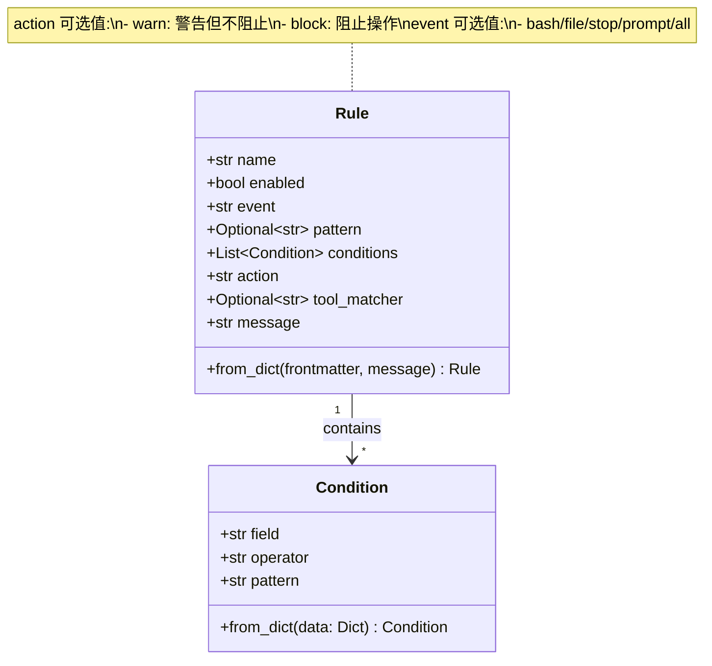

#### 4.2.3 规则文件格式

hookify 使用 Markdown + YAML frontmatter 格式定义规则，无需编码：

**旧式语法（简单 pattern）**：

```markdown
---
name: block-dangerous-rm
enabled: true
event: bash
pattern: rm\s+-rf
action: block
---

⚠️ **Dangerous rm command detected!**

This command could delete important files.
```

**新式语法（多 conditions）**：

```markdown
---
name: warn-sensitive-files
enabled: true
event: file
action: warn
conditions:
  - field: file_path
    operator: regex_match
    pattern: \.env$|\.env\.|credentials|secrets
---

🔐 **Sensitive file detected**

You're editing a file that may contain sensitive data.
```

**两种语法的转换规则**：

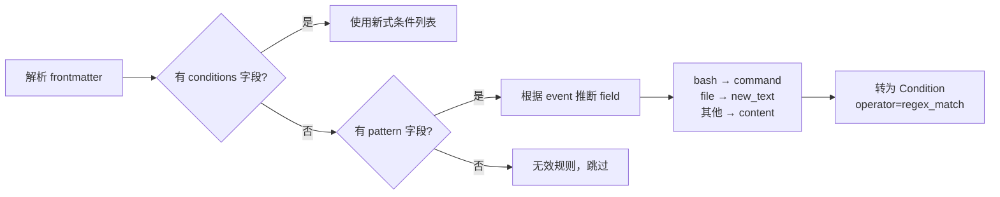

#### 4.2.4 规则文件示例汇总

| 文件名 | 事件 | 动作 | 条件 | 消息 |
|--------|------|------|------|------|
| `dangerous-rm.local.md` | bash | block | 旧式 `pattern: rm\s+-rf` | ⚠️ 危险 rm 命令 |
| `sensitive-files-warning.local.md` | file | warn | 新式 `file_path` regex_match `\.env$|...` | 🔐 敏感文件编辑 |
| `console-log-warning.local.md` | file | warn | 旧式 `pattern: console\.log\(` | 🔍 console.log 检测 |
| `require-tests-stop.local.md` | stop | block | 新式 `transcript` not_contains `npm test|...` | 要求先运行测试 |

#### 4.2.5 YAML Frontmatter 解析器

由于规则文件的 YAML 结构较简单，项目实现了**轻量级 YAML 解析器**而非引入 pyyaml 依赖：

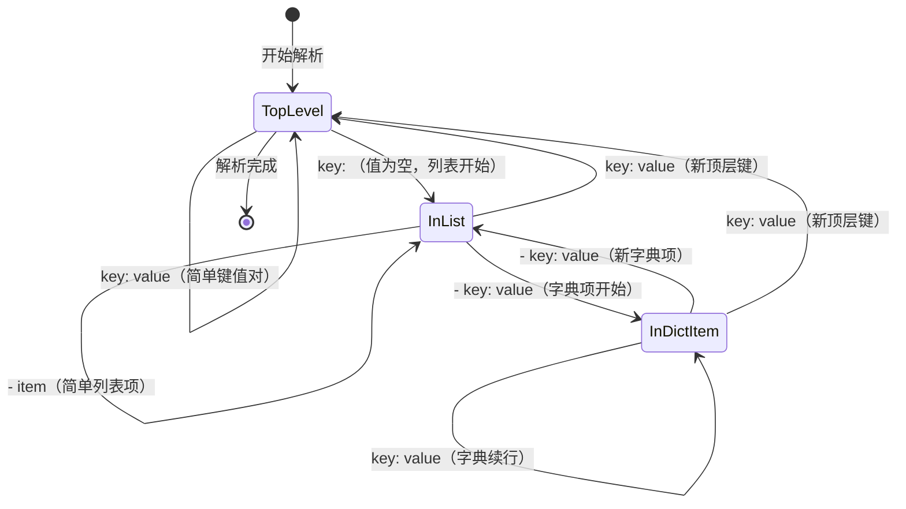

**解析器状态变量**：

| 变量 | 类型 | 说明 |
|------|------|------|
| `current_key` | str \| None | 当前正在解析的顶层键名 |
| `current_list` | list | 当前正在构建的列表值 |
| `current_dict` | dict | 当前正在构建的字典项 |
| `in_list` | bool | 是否正在解析列表值 |
| `in_dict_item` | bool | 是否正在解析列表中的字典项 |

#### 4.2.6 规则加载流程

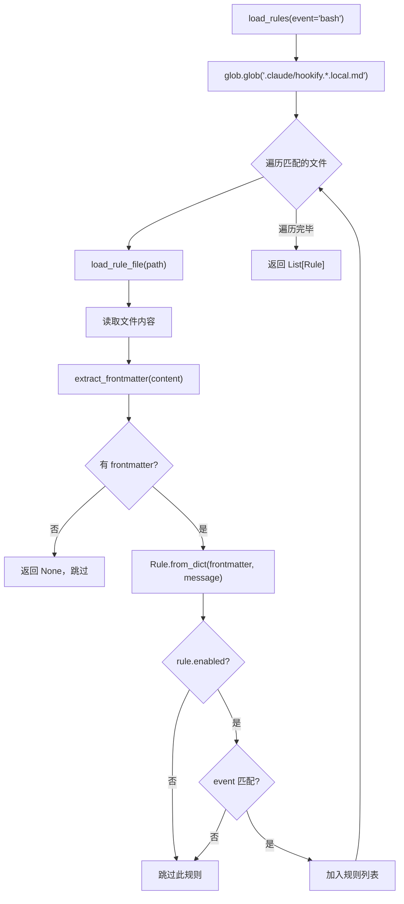

---

### 4.3 hookify 插件 — rule_engine.py（规则评估引擎）

#### 4.3.1 模块信息

| 维度 | 说明 |
|------|------|
| **文件路径** | `plugins/hookify/core/rule_engine.py` |
| **代码行数** | ~310 行 |
| **核心职责** | 将规则与 Hook 输入数据进行匹配评估，输出决策结果 |
| **核心类** | `RuleEngine` |

#### 4.3.2 规则评估完整流程

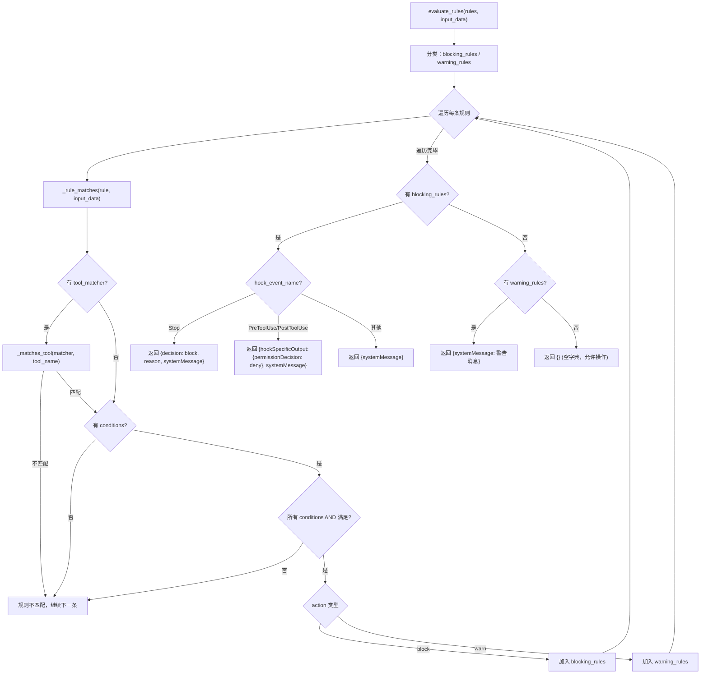

#### 4.3.3 字段提取策略

`_extract_field()` 方法根据工具类型和事件类型，从不同位置提取字段值：

**各工具类型的字段映射表**：

| 工具 | field 值 | 数据来源 |
|------|----------|----------|
| Bash | `command` | `tool_input["command"]` |
| Write | `content` | `tool_input["content"]` |
| Write | `file_path` | `tool_input["file_path"]` |
| Edit | `new_text` / `new_string` | `tool_input["new_string"]` |
| Edit | `old_text` / `old_string` | `tool_input["old_string"]` |
| Edit | `file_path` | `tool_input["file_path"]` |
| MultiEdit | `new_text` / `content` | 所有 edits 的 `new_string` 拼接 |
| Stop | `reason` | `input_data["reason"]` |
| Stop | `transcript` | 读取 `input_data["transcript_path"]` 文件 |
| UserPromptSubmit | `user_prompt` | `input_data["user_prompt"]` |

#### 4.3.4 匹配操作符参考

| 操作符 | 含义 | Python 实现 | 示例 pattern |
|--------|------|-------------|--------------|
| `regex_match` | 正则表达式匹配 | `re.search(pattern, text, re.IGNORECASE)` | `"rm\\s+-rf"` |
| `contains` | 包含子串 | `pattern in field_value` | `"password"` |
| `equals` | 精确相等 | `pattern == field_value` | `"production.yml"` |
| `not_contains` | 不包含子串 | `pattern not in field_value` | `"TODO"` |
| `starts_with` | 前缀匹配 | `field_value.startswith(pattern)` | `"sudo"` |
| `ends_with` | 后缀匹配 | `field_value.endswith(pattern)` | `".env"` |

#### 4.3.5 LRU 正则缓存机制

```python
@lru_cache(maxsize=128)
def compile_regex(pattern: str) -> re.Pattern:
    return re.compile(pattern, re.IGNORECASE)
```

**缓存效果**：

| 场景 | 无缓存 | 有 LRU 缓存 |
|------|--------|--------------|
| 首次编译 pattern `"rm\s+-rf"` | 编译 ~0.1ms | 编译 ~0.1ms |
| 再次使用同一 pattern | 重新编译 ~0.1ms | 直接返回 ~0.001ms |
| 100 次规则评估（5 种 pattern） | 编译 500 次 | 编译 5 次 |

---

### 4.4 hookify 插件 — Hook 入口脚本

#### 4.4.1 四个入口脚本对比

| 脚本 | 事件 | 触发时机 | 加载的 event | 主要用途 |
|------|------|----------|-------------|----------|
| `pretooluse.py` | PreToolUse | 工具执行前 | `bash` / `file` | 拦截危险命令、阻止不安全文件编辑 |
| `posttooluse.py` | PostToolUse | 工具执行后 | `bash` / `file` | 执行后审查、安全提示 |
| `stop.py` | Stop | AI 准备停止 | `stop` | 阻止过早停止、要求完成任务 |
| `userpromptsubmit.py` | UserPromptSubmit | 用户提交提示词 | `prompt` | 注入上下文、敏感词检查 |

#### 4.4.2 入口脚本的通用模板

四个入口脚本遵循相同的代码结构模板：

```python
#!/usr/bin/env python3

import os, sys, json

# 1. 设置 Python 模块搜索路径
PLUGIN_ROOT = os.environ.get('CLAUDE_PLUGIN_ROOT')
if PLUGIN_ROOT:
    sys.path.insert(0, os.path.dirname(PLUGIN_ROOT))
    sys.path.insert(0, PLUGIN_ROOT)

# 2. 容错导入
try:
    from hookify.core.config_loader import load_rules
    from hookify.core.rule_engine import RuleEngine
except ImportError as e:
    print(json.dumps({"systemMessage": f"Hookify import error: {e}"}))
    sys.exit(0)  # 导入失败也不阻断操作

# 3. 主逻辑
def main():
    try:
        input_data = json.load(sys.stdin)  # 读取输入
        rules = load_rules(event=...)       # 加载规则
        result = RuleEngine().evaluate_rules(rules, input_data)  # 评估
        print(json.dumps(result))           # 输出结果
    except Exception as e:
        print(json.dumps({"systemMessage": f"Hookify error: {str(e)}"}))
    finally:
        sys.exit(0)  # 始终正常退出

if __name__ == '__main__':
    main()
```

**设计要点**：
- `try/except/finally` + `sys.exit(0)` 确保任何异常都不会导致 Hook 崩溃
- 阻断逻辑由 `evaluate_rules()` 返回的 JSON 决定，而非退出码
- `CLAUDE_PLUGIN_ROOT` 环境变量解决插件路径的可移植性

#### 4.4.3 事件类型映射

PreToolUse 和 PostToolUse 入口需要将 `tool_name` 映射为 hookify 的事件类型：

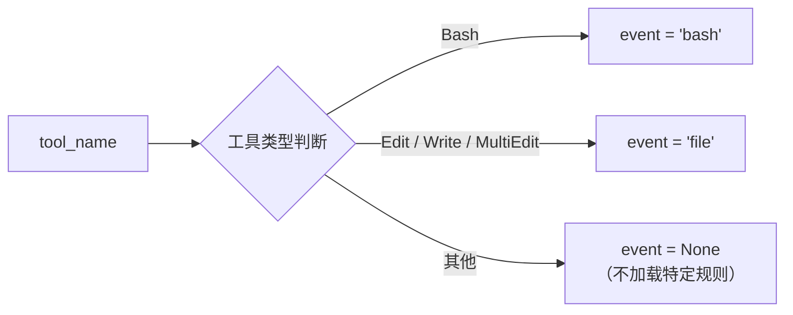

---

### 4.5 security-guidance 插件（高级安全审查）

#### 4.5.1 模块信息

| 维度 | 说明 |
|------|------|
| **文件路径** | `plugins/security-guidance/` |
| **版本** | v2.0.0 |
| **作者** | David Dworken (Anthropic) |
| **核心职责** | 对 AI 生成的代码进行多层安全审查 |
| **依赖** | Claude API（需 API Key 或订阅） |

#### 4.5.2 三层安全审查架构

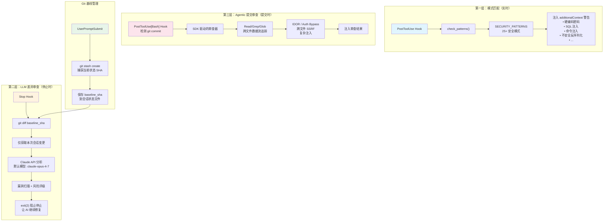

**三层对比**：

| 维度 | 第一层：模式匹配 | 第二层：LLM 差异审查 | 第三层：Agentic 提交审查 |
|------|------------------|---------------------|------------------------|
| **触发时机** | 每次文件编辑后 | AI 准备停止时 | `git commit` 执行后 |
| **检测方式** | 正则表达式 | Claude API 调用 | Claude API + 文件读取 |
| **检测范围** | 单文件单行 | 本次会话所有变更 | 跨文件数据流 |
| **检测速度** | 毫秒级 | 秒级（API 调用） | 十秒级（多轮分析） |
| **检测深度** | 模式级 | 语义级 | 逻辑级 |
| **示例漏洞** | `yaml.load()` | SQL 注入 | IDOR、Auth Bypass |
| **开关控制** | `ENABLE_PATTERN_RULES` | `ENABLE_CODE_SECURITY_REVIEW` | `ENABLE_COMMIT_REVIEW` |

#### 4.5.3 Git 基线管理机制

security-guidance 使用 Git 基线来确保只审查 AI 本次会话新增的代码变更：

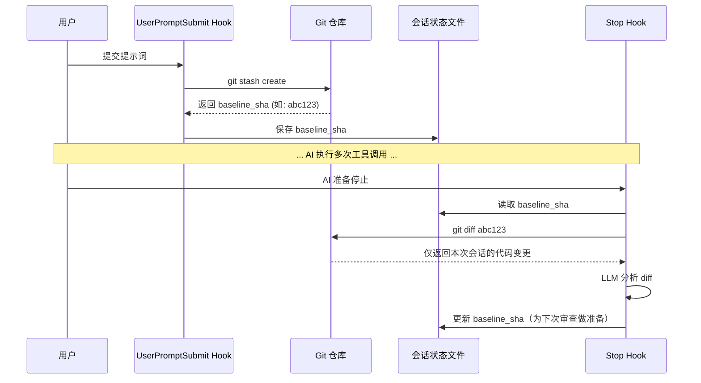

**基线更新策略**：
- 每次 UserPromptSubmit 保存新基线
- 每次 Stop Hook 执行后更新基线，确保下次只审查新变更
- 这样多轮对话中每轮只审查增量代码

#### 4.5.4 环境变量配置

| 变量名 | 默认值 | 说明 |
|--------|--------|------|
| `SECURITY_GUIDANCE_DISABLE` | 未设置 | 设为 `1` 完全禁用插件 |
| `ENABLE_SECURITY_REMINDER` | `1` | 设为 `0` 完全禁用（旧名，兼容） |
| `ENABLE_PATTERN_RULES` | `1` | 设为 `0` 禁用第一层（正则警告） |
| `ENABLE_CODE_SECURITY_REVIEW` | `1` | 设为 `0` 禁用所有 LLM 审查 |
| `ENABLE_STOP_REVIEW` | `1` | 设为 `0` 仅禁用 Stop Hook 的 diff 审查 |
| `ENABLE_COMMIT_REVIEW` | `1` | 设为 `0` 禁用 Agentic 提交审查 |
| `SECURITY_REVIEW_MODEL` | `claude-opus-4-7` | LLM 审查使用的模型 |
| `MAX_STOP_HOOK_FIRINGS` | `3` | Stop Hook 每轮最大触发次数 |
| `MAX_DIFF_FILES` | `30` | 每次 diff 审查最大文件数 |

#### 4.5.5 组织自定义安全策略

security-guidance 支持通过 Markdown 文件注入组织特有的安全规则：

| 文件位置 | 作用域 | 是否提交到 Git |
|----------|--------|---------------|
| `~/.claude/claude-security-guidance.md` | 用户级（所有项目） | 否 |
| `<project>/.claude/claude-security-guidance.md` | 项目级（团队共享） | 是 |
| `<project>/.claude/claude-security-guidance.local.md` | 项目本地（个人覆盖） | 否 |

三个文件按顺序加载并拼接，总大小超过 8KB 时截断尾部。

---

## 五、插件体系详解

### 5.1 插件清单 (plugin.json)

每个插件通过 `.claude-plugin/plugin.json` 声明自身元信息：

**hookify 的 plugin.json**：

```json
{
  "name": "hookify",
  "version": "0.1.0",
  "description": "Easily create hooks to prevent unwanted behaviors by analyzing conversation patterns",
  "author": {
    "name": "Daisy Hollman",
    "email": "daisy@anthropic.com"
  }
}
```

**security-guidance 的 plugin.json**：

```json
{
  "name": "security-guidance",
  "version": "2.0.0",
  "description": "Security review for Claude-generated code...",
  "author": {
    "name": "David Dworken",
    "email": "dworken@anthropic.com"
  },
  "homepage": "https://github.com/anthropics/claude-code/tree/main/plugins/security-guidance"
}
```

### 5.2 Hook 注册配置 (hooks.json)

插件的 `hooks/hooks.json` 文件声明 Hook 事件和处理脚本：

```json
{
  "description": "Hookify plugin - User-configurable hooks from .local.md files",
  "hooks": {
    "PreToolUse": [
      {
        "hooks": [
          {
            "type": "command",
            "command": "python3 ${CLAUDE_PLUGIN_ROOT}/hooks/pretooluse.py",
            "timeout": 10
          }
        ]
      }
    ],
    "PostToolUse": [ ... ],
    "Stop": [ ... ],
    "UserPromptSubmit": [ ... ]
  }
}
```

**配置字段详解**：

| 字段 | 类型 | 说明 |
|------|------|------|
| `description` | str | 插件描述 |
| `hooks` | object | 按事件类型分组的 Hook 列表 |
| `hooks.PreToolUse[].hooks[].type` | str | Hook 类型，`"command"` = 执行外部命令 |
| `hooks.PreToolUse[].hooks[].command` | str | 要执行的命令 |
| `hooks.PreToolUse[].hooks[].timeout` | int | 超时时间（秒），默认 10 秒 |
| `${CLAUDE_PLUGIN_ROOT}` | - | 环境变量占位符，运行时替换为插件根目录 |

### 5.3 插件安装与发现

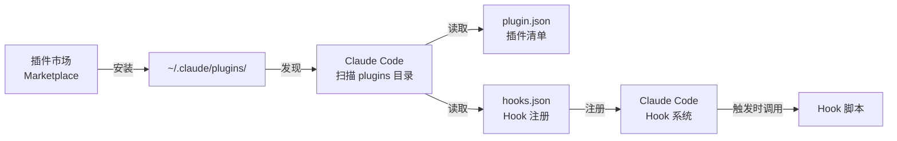

---

## 六、关键技术设计

### 6.1 容错设计

hookify 和 security-guidance 都遵循"**永不因 Hook 错误而阻断正常操作**"的原则：

| 设计点 | 实现方式 | 效果 |
|--------|----------|------|
| 导入失败容错 | `try/except ImportError` → 输出 systemMessage | 插件安装有问题时不影响 Claude Code |
| 规则解析容错 | 单个规则文件解析失败 → 跳过并 log Warning | 一个坏规则不影响其他规则 |
| Hook 执行容错 | `finally: sys.exit(0)` | 任何异常都正常退出 |
| 文件读取容错 | 多级异常捕获 | FileNotFoundError / PermissionError / UnicodeDecodeError 各有处理 |
| API 调用容错 | security-guidance: API 失败 → 静默放行 | API 不可用时不阻塞工作流 |
| 超时保护 | hooks.json 中 `timeout: 10` | Hook 脚本 10 秒超时自动终止 |

**容错优先级链**：


### 6.2 性能优化

| 优化点 | 实现方式 | 量化效果 |
|--------|----------|----------|
| 正则编译缓存 | `@lru_cache(maxsize=128)` | 重复 pattern 编译从 ~0.1ms 降至 ~0.001ms |
| 规则预过滤 | 按事件类型加载规则 | 减少不必要的规则评估量 |
| 大小写不敏感 | `re.IGNORECASE` 标志 | 避免为每个 pattern 写大小写变体 |
| 文件差异限制 | `MAX_DIFF_FILES=30` | 防止超大 diff 消耗 API token |
| 审查频率限制 | `MAX_STOP_HOOK_FIRINGS=3` | 防止 Stop Hook 无限循环 |
| 滚动窗口限速 | `atomic_check_rate_limit()` | 每小时窗口限制审查次数 |

### 6.3 零依赖设计

hookify 插件**仅使用 Python 标准库**，不依赖任何第三方包：

| 模块 | 用途 |
|------|------|
| `json` | JSON 解析与序列化 |
| `re` | 正则表达式匹配 |
| `os` / `sys` / `glob` | 系统操作与文件发现 |
| `dataclasses` | 数据类定义（替代手写 `__init__` 等） |
| `functools.lru_cache` | LRU 缓存装饰器 |
| `typing` | 类型注解（List, Optional, Dict, Any） |

security-guidance 额外使用的标准库模块：

| 模块 | 用途 |
|------|------|
| `urllib.request` | 调用 Claude API（无需 requests 库） |
| `subprocess` | 执行 Git 命令 |
| `threading` | 并发执行 Git 操作 |
| `fcntl` | 文件锁（Unix 平台） |
| `concurrent.futures` | 线程池（并发 git 操作） |

### 6.4 会话状态管理

security-guidance 通过文件系统实现跨 Hook 调用的状态持久化：

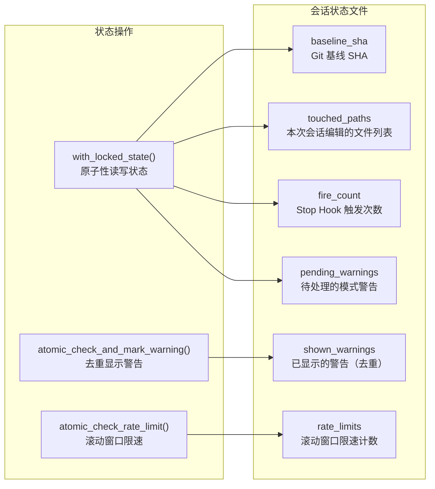

**状态操作的关键函数**：

| 函数 | 功能 | 原子性保证 |
|------|------|-----------|
| `with_locked_state(session_id, fn)` | 加锁读取状态 → 执行 fn → 保存状态 | fcntl 文件锁 |
| `atomic_check_and_mark_warning(session_id, key)` | 检查警告是否已显示并标记 | 通过 with_locked_state |
| `atomic_check_rate_limit(session_id, key, max, window)` | 滚动窗口限速 | 通过 with_locked_state |
| `save_baseline_sha(session_id, sha)` | 保存 Git 基线 | 通过 with_locked_state |

### 6.5 安全模式库（SECURITY_PATTERNS）

security-guidance 的 `patterns.py` 定义了 25+ 种安全检测模式：

| 漏洞类别 | 检测模式示例 | 严重度 |
|----------|-------------|--------|
| 不安全反序列化 | `pickle.load`, `yaml.load`, `torch.load(weights_only=False)` | 高 |
| 硬编码密钥 | `API_KEY = "..."`, `SECRET = "..."` | 高 |
| SQL 注入 | `f"SELECT ... WHERE {user_input}"` | 高 |
| 命令注入 | `os.system(user_input)`, `subprocess.call(cmd, shell=True)` | 高 |
| XSS 跨站脚本 | `innerHTML = user_data`, `document.write(user_data)` | 高 |
| SSRF 服务端请求伪造 | `requests.get(user_url)` | 中 |
| 路径遍历 | `open(user_path)`, `os.path.join(base, user_input)` | 中 |
| 不安全会话配置 | `SESSION_COOKIE_SECURE = False` | 中 |
| 调试代码 | `console.log()`, `debugger` | 低 |

---

## 七、项目目录结构

```
claude-code/
├── examples/
│   └── hooks/
│       └── bash_command_validator_example.py        # 简单 Hook 示例（~80行）
│
├── plugins/
│   ├── hookify/                                     # 可配置规则引擎插件
│   │   ├── .claude-plugin/
│   │   │   └── plugin.json                          # 插件清单（名称/版本/作者）
│   │   ├── agents/
│   │   │   └── conversation-analyzer.md             # 会话分析 Agent
│   │   ├── commands/
│   │   │   ├── configure.md                         # /hookify:configure 命令
│   │   │   ├── help.md                              # /hookify:help 命令
│   │   │   ├── hookify.md                           # /hookify 主命令
│   │   │   └── list.md                              # /hookify:list 命令
│   │   ├── core/
│   │   │   ├── __init__.py
│   │   │   ├── config_loader.py                     # 规则配置加载器（~290行）
│   │   │   └── rule_engine.py                       # 规则评估引擎（~310行）
│   │   ├── hooks/
│   │   │   ├── __init__.py
│   │   │   ├── hooks.json                           # Hook 注册配置
│   │   │   ├── pretooluse.py                        # 工具执行前 Hook
│   │   │   ├── posttooluse.py                       # 工具执行后 Hook
│   │   │   ├── stop.py                              # AI 停止 Hook
│   │   │   └── userpromptsubmit.py                  # 用户提交 Hook
│   │   ├── matchers/
│   │   │   └── __init__.py
│   │   ├── skills/
│   │   │   └── writing-rules/SKILL.md               # 规则编写技能
│   │   ├── utils/
│   │   │   └── __init__.py
│   │   ├── examples/                                # 规则文件示例
│   │   │   ├── dangerous-rm.local.md                # 阻止 rm -rf
│   │   │   ├── sensitive-files-warning.local.md     # 警告敏感文件编辑
│   │   │   ├── console-log-warning.local.md         # 警告 console.log
│   │   │   └── require-tests-stop.local.md          # 要求运行测试后才能停止
│   │   └── README.md
│   │
│   ├── security-guidance/                           # 安全审查插件
│   │   ├── .claude-plugin/
│   │   │   └── plugin.json                          # 插件清单（v2.0.0）
│   │   ├── hooks/
│   │   │   ├── security_reminder_hook.py             # 主 Hook 脚本（2000+行）
│   │   │   ├── _base.py                             # 基础工具（日志/版本/用量）
│   │   │   ├── diffstate.py                         # Git 基线与差异状态管理
│   │   │   ├── ensure_agent_sdk.py                  # Agent SDK 检测
│   │   │   ├── extensibility.py                     # 用户自定义安全模式
│   │   │   ├── gitutil.py                           # Git 工具函数
│   │   │   ├── llm.py                               # Claude API 调用封装
│   │   │   ├── patterns.py                          # 25+ 安全模式库
│   │   │   ├── review_api.py                        # 审查 API 封装
│   │   │   ├── session_state.py                     # 会话状态持久化
│   │   │   └── sg-python.sh                         # Python 解释器查找脚本
│   │   └── README.md
│   │
│   ├── code-review/                                 # 代码审查插件
│   ├── feature-dev/                                 # 功能开发插件
│   ├── pr-review-toolkit/                           # PR 审查工具包
│   ├── plugin-dev/                                  # 插件开发工具
│   └── ...                                          # 其他插件
│
├── examples/                                        # 其他示例
│   ├── mdm/                                         # 移动设备管理配置
│   └── settings/                                    # 安全策略配置示例
│       ├── settings-bash-sandbox.json               # Bash 沙箱配置
│       ├── settings-lax.json                         # 宽松配置
│       └── settings-strict.json                      # 严格配置
│
├── scripts/                                         # GitHub Actions 脚本
└── docs/                                            # 文档
    └── technical_design.md                          # 本文档
```

---

## 八、数据字典与字段映射

### 8.1 Hook 输入 JSON 字段

| 字段 | 类型 | 必填 | 适用事件 | 说明 |
|------|------|------|----------|------|
| `hook_event_name` | str | 是 | 全部 | 事件名称：PreToolUse/PostToolUse/Stop/UserPromptSubmit |
| `tool_name` | str | 是 | PreToolUse/PostToolUse | 工具名称：Bash/Edit/Write/MultiEdit/Read/Grep/Glob |
| `tool_input` | object | 是 | PreToolUse/PostToolUse | 工具输入参数（结构因工具而异） |
| `session_id` | str | 是 | 全部 | 会话唯一标识 |
| `cwd` | str | 是 | 全部 | 当前工作目录 |
| `reason` | str | 否 | Stop | AI 给出的停止原因 |
| `transcript_path` | str | 否 | Stop | 会话记录文件路径 |
| `user_prompt` | str | 否 | UserPromptSubmit | 用户输入的提示词 |

### 8.2 Hook 输出 JSON 字段

| 字段 | 类型 | 适用场景 | 说明 |
|------|------|----------|------|
| `systemMessage` | str | 警告/阻止 | 传递给 AI 的消息 |
| `hookSpecificOutput` | object | PreToolUse/PostToolUse | 事件特定输出 |
| `hookSpecificOutput.hookEventName` | str | PreToolUse/PostToolUse | 事件名称 |
| `hookSpecificOutput.permissionDecision` | str | PreToolUse/PostToolUse | `"deny"` = 拒绝执行 |
| `decision` | str | Stop | `"block"` = 阻止停止 |
| `reason` | str | Stop | 阻止停止的原因 |
| `additionalContext` | str | PostToolUse | 注入到 AI 上下文的额外信息 |
| `metrics` | object | 全部 | 遥测数据 |
| `rewakeSummary` | str | Stop (async) | 任务通知摘要 |

---

## 九、配置与部署指南

### 9.1 快速开始 — 创建简单 Hook

**步骤 1**：创建 Python 脚本

```python
#!/usr/bin/env python3
import json, sys

input_data = json.load(sys.stdin)
if input_data.get("tool_name") == "Bash":
    command = input_data.get("tool_input", {}).get("command", "")
    if "rm -rf" in command:
        print("⚠️ 危险的 rm -rf 命令！", file=sys.stderr)
        sys.exit(2)  # 阻止操作
sys.exit(0)  # 放行
```

**步骤 2**：在 Claude Code settings 中注册

```json
{
  "hooks": {
    "PreToolUse": [
      {
        "matcher": "Bash",
        "hooks": [{
          "type": "command",
          "command": "python3 /path/to/my_hook.py"
        }]
      }
    ]
  }
}
```

### 9.2 使用 hookify 插件

**步骤 1**：安装插件

```bash
# 通过市场安装（推荐）
# 或手动指定插件目录
claude --plugin-dir /path/to/hookify
```

**步骤 2**：创建规则文件

在项目根目录的 `.claude/` 下创建 `hookify.{name}.local.md`：

```markdown
---
name: my-rule
enabled: true
event: bash
pattern: rm\s+-rf
action: block
---

⚠️ 危险命令被拦截！
```

**步骤 3**：无需重启，规则立即生效

### 9.3 使用 security-guidance 插件

**步骤 1**：安装插件（Claude Code v2.1.144+ 默认包含）

```bash
/plugin install security-guidance@claude-plugins-official
```

**步骤 2**：配置组织安全策略（可选）

创建 `.claude/claude-security-guidance.md`：

```markdown
# 我的安全规则

- 所有数据库查询必须使用参数化查询
- 用户输入必须经过验证才能使用
- 禁止在生产代码中使用 eval()
```

**步骤 3**：正常使用 Claude Code，插件自动审查

### 9.4 安全策略配置示例

项目在 `examples/settings/` 提供了三种预设策略：

| 配置文件 | 策略 | 说明 |
|----------|------|------|
| `settings-strict.json` | 严格 | 限制最多操作，适合生产环境 |
| `settings-lax.json` | 宽松 | 限制最少操作，适合个人项目 |
| `settings-bash-sandbox.json` | Bash 沙箱 | 限制 Bash 命令在沙箱中执行 |

---

## 十、扩展开发指南

### 10.1 开发自定义 Hook 脚本的步骤


**步骤详解**：

1. **确定需求** — 明确要拦截什么操作、什么条件下拦截、拦截后做什么
2. **选择事件类型** — PreToolUse（执行前）/ PostToolUse（执行后）/ Stop（停止时）/ UserPromptSubmit（提交时）
3. **编写脚本** — 参考模板，从 stdin 读 JSON，实现逻辑，通过退出码或 stdout JSON 输出结果
4. **测试脚本** — `echo '{"tool_name":"Bash","tool_input":{"command":"grep foo"}}' | python3 my_hook.py`
5. **注册 Hook** — 在 Claude Code settings 的 hooks 字段中配置
6. **迭代优化** — 根据实际使用调整规则、增加容错

### 10.2 开发 hookify 规则的步骤

1. 确定规则名称（如 `block-dangerous-rm`）
2. 选择事件类型（`bash` / `file` / `stop` / `prompt` / `all`）
3. 选择动作（`warn` 警告 / `block` 阻止）
4. 编写匹配条件（简单 pattern 或复杂 conditions）
5. 编写消息正文（Markdown 格式，支持加粗、列表等）
6. 创建文件 `.claude/hookify.{name}.local.md`

### 10.3 开发 Claude Code 插件的步骤

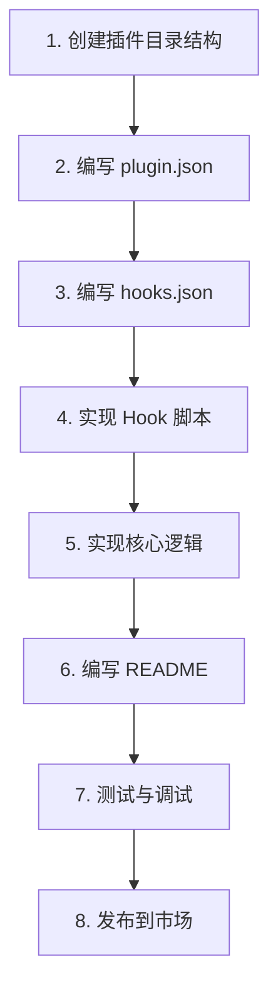

**标准插件目录结构**：

```
my-plugin/
├── .claude-plugin/
│   └── plugin.json          # 插件清单（名称/版本/描述/作者）
├── hooks/
│   ├── hooks.json            # Hook 注册配置
│   └── my_hook.py            # Hook 脚本
├── commands/                 # 自定义命令（可选）
│   └── my-command.md
├── agents/                   # 自定义 Agent（可选）
│   └── my-agent.md
├── skills/                   # 自定义技能（可选）
│   └── my-skill/SKILL.md
└── README.md                 # 插件文档
```

### 10.4 最佳实践

| 实践 | 说明 | 示例 |
|------|------|------|
| **容错优先** | 永不因 Hook 错误阻断正常操作 | `finally: sys.exit(0)` |
| **快速响应** | Hook 脚本必须在 timeout 内完成 | 避免耗时网络请求 |
| **最小权限** | 只拦截必要的操作 | 使用 matcher 过滤工具类型 |
| **幂等设计** | 同一输入多次执行结果一致 | 避免副作用 |
| **零依赖** | 仅使用 Python 标准库 | `json`, `re`, `os`, `sys` |
| **可观测性** | 记录关键日志到 stderr | `print(..., file=sys.stderr)` |
| **可配置性** | 通过环境变量/文件控制行为 | `ENABLE_PATTERN_RULES` |
| **向后兼容** | 支持新旧两种配置格式 | hookify 的 pattern 和 conditions |

---

## 附录 A：正则表达式速查

本项目规则文件中常用的正则语法：

| 语法 | 含义 | 本项目使用示例 |
|------|------|---------------|
| `^` | 匹配字符串开头 | `^grep\b` — grep 必须是命令开头 |
| `$` | 匹配字符串结尾 | `\.env$` — 以 .env 结尾 |
| `\b` | 单词边界 | `grep\b` — 完整单词 grep |
| `\s` | 空白字符 | `rm\s+-rf` — rm 和 -rf 之间有空格 |
| `\S` | 非空白字符 | `find\s+\S+\s+-name` — 搜索路径 |
| `\d` | 数字 | `\d{1,3}` — 1到3位数字 |
| `.` | 任意字符 | `.*` — 任意字符零次或多次 |
| `+` | 前一个元素一次或多次 | `\s+` — 一个或多个空白 |
| `*` | 前一个元素零次或多次 | `.*` — 任意字符任意次数 |
| `?` | 前一个元素零次或一次 | `\d?` — 零或一个数字 |
| `\|` | 或（在组内） | `(eval\|exec)\(` — eval( 或 exec( |
| `()` | 分组捕获 | `(rm)\s+(-rf)` — 分别匹配 |
| `(?:...)` | 非捕获分组 | `(?:http\|https)` — 仅分组不捕获 |
| `(?=...)` | 正向前瞻 | `grep(?=\s+file)` — grep 后跟 file |
| `(?!...)` | 负向前瞻 | `grep(?!.*\|)` — grep 后不跟管道 |
| `\` | 转义特殊字符 | `console\.log` — 字面量点号 |
| `[...]` | 字符类 | `[rm]` — r 或 m |
| `[^...]` | 否定字符类 | `[^a-z]` — 非小写字母 |

---

## 附录 B：错误码与异常处理

### B.1 Hook 退出码

| 退出码 | 含义 | AI 可见 | 用户可见 | 操作结果 |
|--------|------|---------|---------|----------|
| 0 | 正常 | 否 | 否 | 放行/不干预 |
| 1 | 警告 | **否** | 是 | 放行，但用户看到警告 |
| 2 | 阻断 | 是 | 是 | 阻止操作，AI 根据消息调整 |

### B.2 常见异常及处理

| 异常类型 | 触发场景 | hookify 处理 | security-guidance 处理 |
|----------|----------|-------------|----------------------|
| `json.JSONDecodeError` | stdin 输入非合法 JSON | exit(1) | log + 静默放行 |
| `ImportError` | 模块导入失败 | systemMessage + exit(0) | N/A（内部模块） |
| `FileNotFoundError` | 规则文件/状态文件不存在 | log Warning + 跳过 | log + 静默放行 |
| `PermissionError` | 文件权限不足 | log Warning + 跳过 | log + 静默放行 |
| `UnicodeDecodeError` | 文件编码错误 | log Warning + 跳过 | log + 静默放行 |
| `re.error` | 无效正则表达式 | log + 返回 False | N/A |
| `IOError` / `OSError` | 通用 I/O 错误 | log Warning + 跳过 | log + 静默放行 |
| `Exception` | 未知异常 | systemMessage + exit(0) | log + 静默放行 |

### B.3 调试技巧

**1）手动测试 Hook 脚本**：

```bash
# 模拟 Claude Code 传入的 JSON 输入
echo '{"tool_name":"Bash","tool_input":{"command":"grep foo bar.txt"}}' | \
  python3 /path/to/hook_script.py

# 检查退出码
echo $?
```

**2）查看 security-guidance 日志**：

```bash
cat ~/.claude/security/log.txt
```

**3）启用 Claude Code 调试模式**：

```bash
claude --debug-file /tmp/claude/debug.txt
grep "security_reminder_hook" /tmp/claude/debug.txt
```

**4）测试 hookify 规则正则**：

```bash
python3 -c "import re; print(re.search(r'rm\s+-rf', 'rm -rf /tmp/test'))"
# <re.Match object; span=(0, 7), match='rm -rf'>

python3 -c "import re; print(re.search(r'rm\s+-rf', 'ls -la'))"
# None
```
