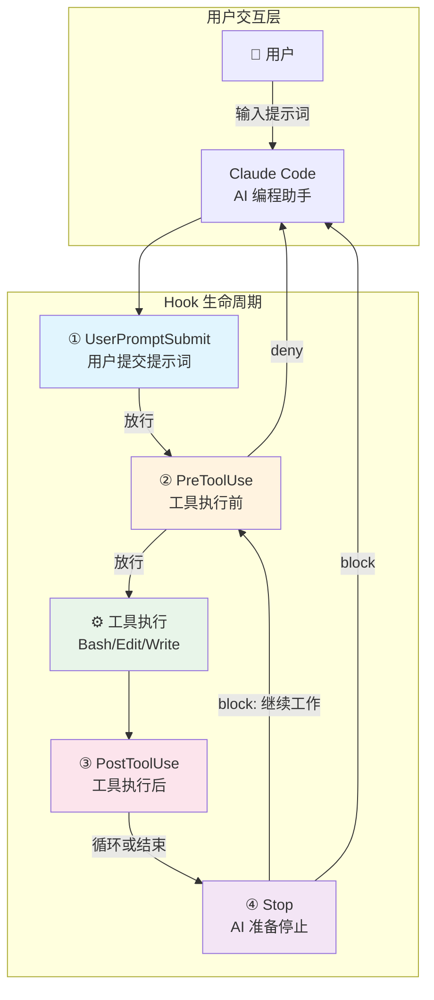
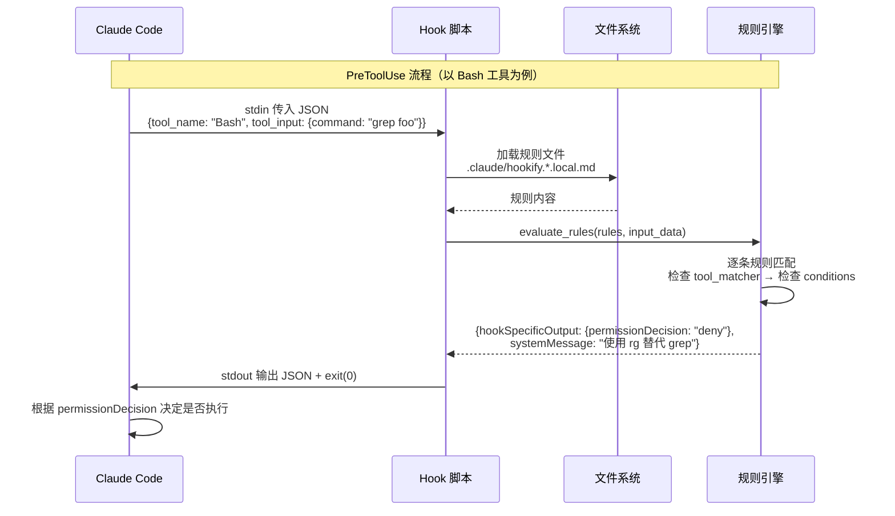
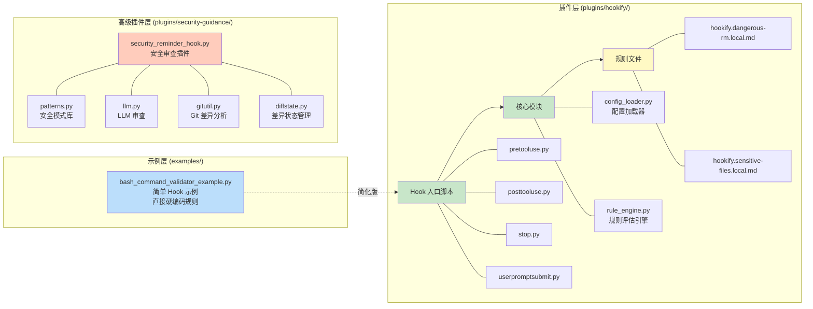
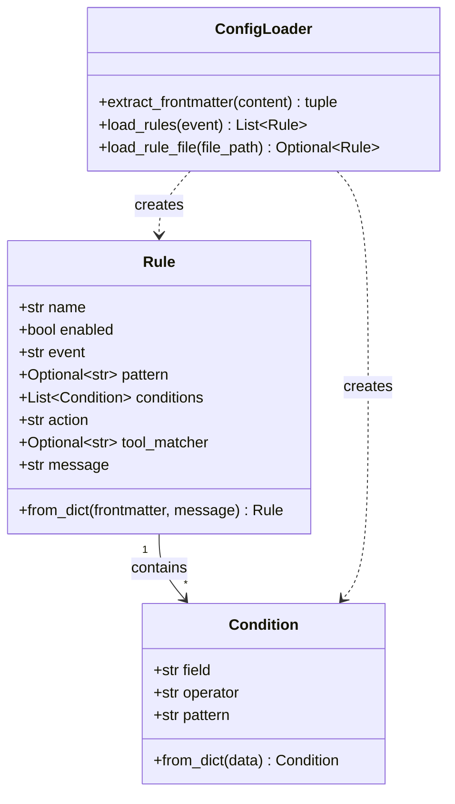
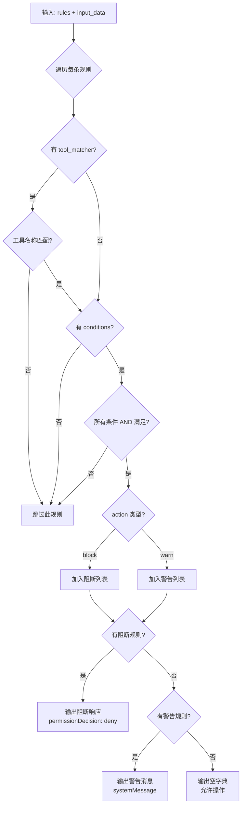
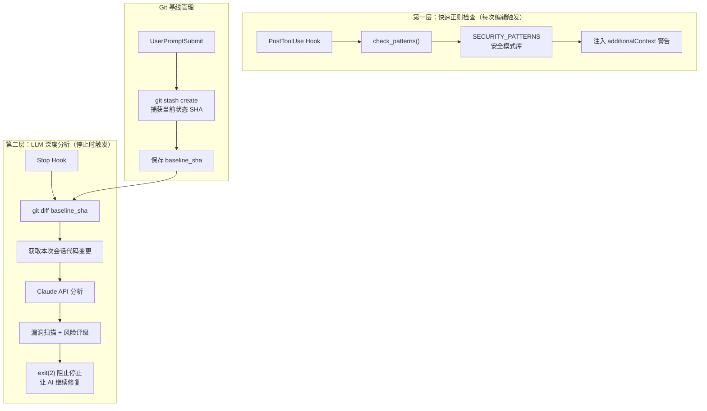

# Claude Code Hooks 项目技术方案文档

## 一、项目概述

### 1.1 项目定位

本项目是 **Claude Code** 的官方示例与插件仓库，提供了 Hook（钩子）机制的核心示例和可复用的插件实现。Claude Code 是 Anthropic 推出的 AI 编程助手，Hook 机制允许用户在 AI 助手执行操作的特定生命周期节点插入自定义逻辑，实现安全审查、行为约束、规范提醒等功能。

### 1.2 核心价值

- **安全防护**：在 AI 执行命令前拦截危险操作（如 `rm -rf`、敏感文件写入）
- **行为引导**：引导 AI 使用更优工具（如用 `rg` 替代 `grep`）
- **规范执行**：在代码编辑后自动检查安全漏洞、编码规范等
- **流程控制**：阻止 AI 过早停止，确保审查流程完整执行

---

## 二、系统架构

### 2.1 整体架构图



### 2.2 Hook 系统数据流



### 2.3 组件架构图



---

## 三、核心模块详解

### 3.1 bash_command_validator_example.py（简单示例）

| 维度 | 说明 |
|------|------|
| **位置** | `examples/hooks/bash_command_validator_example.py` |
| **类型** | PreToolUse Hook（仅匹配 Bash 工具） |
| **功能** | 校验 Bash 命令，拦截 `grep` 和 `find -name`，建议使用 `rg` |
| **实现方式** | 硬编码规则列表 + 正则匹配 |
| **输入** | stdin 接收 Claude Code 传入的 JSON |
| **输出** | stderr 输出校验消息 |
| **退出码** | 0=放行，1=警告用户，2=阻止+通知AI |

**核心数据流**：

```
Claude Code → stdin JSON → 解析 → 校验规则匹配 → stderr 输出 + 退出码 → Claude Code 决策
```

### 3.2 hookify 插件（可配置规则引擎）

| 维度 | 说明 |
|------|------|
| **位置** | `plugins/hookify/` |
| **类型** | 全生命周期 Hook（PreToolUse + PostToolUse + Stop + UserPromptSubmit） |
| **功能** | 用户通过 Markdown 文件自定义规则，插件自动加载并评估 |
| **实现方式** | 配置加载 + 规则引擎 + 策略模式 |
| **设计特点** | 零依赖、容错优先、规则热加载 |

#### 3.2.1 config_loader.py（配置加载器）

**职责**：从 `.claude/hookify.*.local.md` 文件加载和解析规则

**核心类**：



**规则文件格式**：

```markdown
---
name: dangerous-rm
enabled: true
event: bash
conditions:
  - field: command
    operator: regex_match
    pattern: "rm\\s+-rf"
action: warn
---

⚠️ 检测到危险的 rm -rf 命令！请确认操作范围。
```

#### 3.2.2 rule_engine.py（规则评估引擎）

**职责**：将规则与 Hook 输入数据进行匹配评估，输出决策结果

**核心流程**：



**匹配操作符支持**：

| 操作符 | 含义 | 示例 |
|--------|------|------|
| `regex_match` | 正则表达式匹配 | `pattern: "rm\\s+-rf"` |
| `contains` | 包含子串 | `pattern: "password"` |
| `equals` | 精确相等 | `pattern: "production.yml"` |
| `not_contains` | 不包含子串 | `pattern: "TODO"` |
| `starts_with` | 前缀匹配 | `pattern: "sudo"` |
| `ends_with` | 后缀匹配 | `pattern: ".env"` |

### 3.3 security-guidance 插件（高级安全审查）

| 维度 | 说明 |
|------|------|
| **位置** | `plugins/security-guidance/` |
| **类型** | 全生命周期 Hook + LLM 审查 |
| **功能** | 两层安全审查：快速正则检查 + LLM 深度分析 |
| **实现方式** | 模式匹配 + Git diff + Claude API 调用 |

**双层审查架构**：



---

## 四、Hook 通信协议

### 4.1 输入格式（Claude Code → Hook 脚本）

通过 **stdin** 传入 JSON 数据，不同事件的输入结构如下：

**PreToolUse / PostToolUse 事件**：

```json
{
  "tool_name": "Bash",
  "tool_input": {
    "command": "grep -r 'password' /etc"
  },
  "hook_event_name": "PreToolUse",
  "session_id": "abc123",
  "cwd": "/home/user/project"
}
```

**Stop 事件**：

```json
{
  "hook_event_name": "Stop",
  "reason": "Task completed",
  "transcript_path": "/tmp/session/transcript.txt",
  "session_id": "abc123"
}
```

**UserPromptSubmit 事件**：

```json
{
  "hook_event_name": "UserPromptSubmit",
  "user_prompt": "帮我重构这段代码",
  "session_id": "abc123",
  "cwd": "/home/user/project"
}
```

### 4.2 输出格式（Hook 脚本 → Claude Code）

**简单示例脚本的输出（stderr + 退出码）**：

| 退出码 | stderr | 效果 |
|--------|--------|------|
| 0 | 无 | 允许操作继续 |
| 1 | 错误消息 | 向用户显示，不通知 AI |
| 2 | 校验消息 | 阻止操作，通知 AI |

**插件脚本的输出（stdout JSON）**：

```json
{
  "hookSpecificOutput": {
    "hookEventName": "PreToolUse",
    "permissionDecision": "deny"
  },
  "systemMessage": "**[dangerous-rm]**\n⚠️ 检测到危险命令！"
}
```

---

## 五、关键技术设计

### 5.1 容错设计

| 设计点 | 实现方式 |
|--------|----------|
| 导入失败容错 | `try/except ImportError` → 输出 systemMessage 而非崩溃 |
| 规则解析容错 | 单个规则文件解析失败不影响其他规则加载 |
| Hook 执行容错 | `finally: sys.exit(0)` 确保始终正常退出 |
| 文件读取容错 | 多级异常捕获（FileNotFoundError / PermissionError / UnicodeDecodeError） |

### 5.2 性能优化

| 优化点 | 实现方式 |
|--------|----------|
| 正则编译缓存 | `@lru_cache(maxsize=128)` 缓存编译后的 Pattern 对象 |
| 规则预过滤 | 按事件类型过滤规则，减少不必要的规则评估 |
| 不区分大小写 | `re.IGNORECASE` 标志避免写多个大小写变体 |

### 5.3 零依赖设计

hookify 插件仅使用 Python 标准库，不依赖任何第三方包：

- `json` — JSON 解析
- `re` — 正则匹配
- `os` / `sys` / `glob` — 系统操作
- `dataclasses` — 数据类
- `functools.lru_cache` — 缓存

security-guidance 插件额外使用 `urllib.request` 调用 Claude API（同样无需第三方依赖）。

---

## 六、目录结构

```
claude-code/
├── examples/
│   └── hooks/
│       └── bash_command_validator_example.py   # 简单 Hook 示例
│
├── plugins/
│   ├── hookify/                                # 可配置规则引擎插件
│   │   ├── .claude-plugin/plugin.json          # 插件清单
│   │   ├── core/
│   │   │   ├── config_loader.py                # 规则配置加载器
│   │   │   └── rule_engine.py                  # 规则评估引擎
│   │   ├── hooks/
│   │   │   ├── hooks.json                      # Hook 注册配置
│   │   │   ├── pretooluse.py                   # 工具执行前 Hook
│   │   │   ├── posttooluse.py                  # 工具执行后 Hook
│   │   │   ├── stop.py                         # AI 停止 Hook
│   │   │   └── userpromptsubmit.py             # 用户提交 Hook
│   │   └── examples/                           # 规则文件示例
│   │       ├── dangerous-rm.local.md
│   │       ├── sensitive-files-warning.local.md
│   │       └── ...
│   │
│   ├── security-guidance/                      # 安全审查插件
│   │   ├── hooks/
│   │   │   ├── security_reminder_hook.py       # 主 Hook 脚本
│   │   │   ├── patterns.py                     # 安全模式库
│   │   │   ├── llm.py                          # LLM API 调用
│   │   │   ├── gitutil.py                      # Git 工具函数
│   │   │   ├── diffstate.py                    # 差异状态管理
│   │   │   └── ...
│   │   └── ...
│   │
│   └── ...                                     # 其他插件
```

---

## 七、扩展指南

### 7.1 编写自定义 Hook 脚本

最简单的方式是参考 `bash_command_validator_example.py`：

1. 创建 Python 脚本，从 `sys.stdin` 读取 JSON 输入
2. 实现自定义校验逻辑
3. 通过 `sys.stderr` 输出消息
4. 用退出码（0/1/2）控制行为

### 7.2 使用 hookify 插件

1. 安装 hookify 插件
2. 在 `.claude/` 目录下创建 `hookify.{name}.local.md` 规则文件
3. 定义 frontmatter（规则元数据）和消息正文
4. 无需重启，规则会被自动加载

### 7.3 开发高级插件

参考 `security-guidance` 插件的架构：

1. 创建插件清单 `.claude-plugin/plugin.json`
2. 编写 `hooks.json` 注册 Hook 事件
3. 实现核心逻辑，支持配置化
4. 加入 LLM 能力增强审查深度
